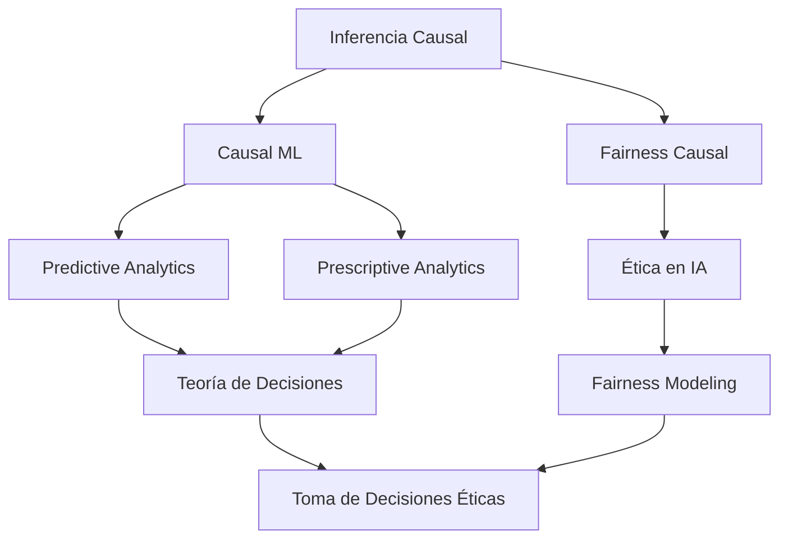

# Ejercicios de Investigación Doctoral

Este repositorio contiene una colección de ejercicios y proyectos desarrollados durante mi programa de doctorado. Los trabajos aquí presentados abarcan diversas áreas de la ciencia de datos e inteligencia artificial.

## 🚀 Uso

Los códigos y ejercicios están documentados para facilitar su comprensión y reproducibilidad. Cada proyecto incluye:
- Descripción del problema
- Metodología utilizada
- Implementación
- Resultados y conclusiones

## 📝 Nota

Este repositorio es parte de mi trabajo doctoral y está en constante actualización conforme avanzo en mi investigación.

# Investigación Doctoral en Inferencia Causal y Analytics

Este repositorio contiene trabajos de investigación y proyectos desarrollados durante mi programa de doctorado, enfocados en la intersección entre inferencia causal, aprendizaje automático y análisis predictivo-prescriptivo, con especial énfasis en la equidad y ética en los modelos.

## 🎯 Líneas de Investigación Principal

### 1. Inferencia Causal y Causal Machine Learning
- **Fundamentos de Inferencia Causal**
  - Modelos Causales Estructurales (SCM)
  - Gráficos Causales (DAGs)
  - Métodos de Identificación Causal
  - Contrafactuales y Efectos Causales

- **Causal Machine Learning**
  - Redes Neuronales Causales
  - Algoritmos de Descubrimiento Causal
  - Transfer Learning Causal
  - Meta-learning para Inferencia Causal

### 2. Analytics Avanzado
- **Analítica Predictiva**
  - Modelos de Series Temporales
  - Métodos de Predicción Probabilística
  - Deep Learning para Predicción
  - Validación de Modelos Predictivos

- **Analítica Prescriptiva**
  - Optimización de Decisiones
  - Programación Estocástica
  - Simulación Monte Carlo
  - Métodos de Optimización Robusta

### 3. Teoría de Decisiones
- **Frameworks de Decisión**
  - Decisión Bajo Incertidumbre
  - Teoría de Utilidad
  - Procesos de Decisión de Markov
  - Aprendizaje por Refuerzo para Toma de Decisiones

- **Métodos de Evaluación**
  - Análisis de Sensibilidad
  - Validación de Decisiones
  - Métricas de Desempeño
  - Evaluación de Impacto

### 4. Fairness y Ética en Modelado
- **Fairness en Machine Learning**
  - Métricas de Equidad
  - Debiasing de Modelos
  - Fairness Causal
  - Evaluación de Sesgos

- **Ética en IA**
  - Frameworks Éticos
  - Transparencia y Explicabilidad
  - Auditoría de Modelos
  - Gobernanza de IA

## 🔍 Mapa de Relaciones entre Tópicos



## 📁 Estructura del Repositorio

```
├── causal-inference/
│   ├── structural-causal-models/
│   ├── causal-discovery/
│   └── counterfactuals/
├── causal-ml/
│   ├── neural-causal-models/
│   ├── transfer-learning/
│   └── meta-learning/
├── analytics/
│   ├── predictive/
│   └── prescriptive/
├── decision-theory/
│   ├── uncertainty-models/
│   ├── utility-theory/
│   └── reinforcement-learning/
└── fairness-ethics/
    ├── fairness-metrics/
    ├── debiasing/
    └── ethical-frameworks/
```

## 📊 Metodologías y Frameworks

### Herramientas de Inferencia Causal
- DoWhy
- CausalNex
- EconML
- CausalML

### Frameworks de Machine Learning
- PyTorch
- TensorFlow
- Scikit-learn
- MLflow

### Herramientas de Analytics
- Prophet
- PyCaret
- Optuna
- OR-Tools

### Frameworks de Fairness
- AI Fairness 360
- Aequitas
- Fairlearn
- What-If Tool

## 📝 Documentación

Cada proyecto incluye:
- Fundamentación teórica
- Implementación metodológica
- Análisis experimental
- Evaluación de resultados
- Consideraciones éticas
- Implicaciones prácticas

## 🔗 Keywords
#causalinference #causalmachinelearning #predictiveanalytics #prescriptiveanalytics #decisiontheory #fairness #ethicalai #appliedml


## 💡 Casos de Estudio y Proyectos

Cada proyecto en este repositorio incluye:
- Contexto y objetivos de investigación
- Metodología y marco teórico
- Implementación y análisis
- Resultados y conclusiones
- Implicaciones para el liderazgo y la toma de decisiones

## 📫 Contacto

[Información de contacto académico]

## 📄 Licencia

[Especifica la licencia de tu trabajo]
